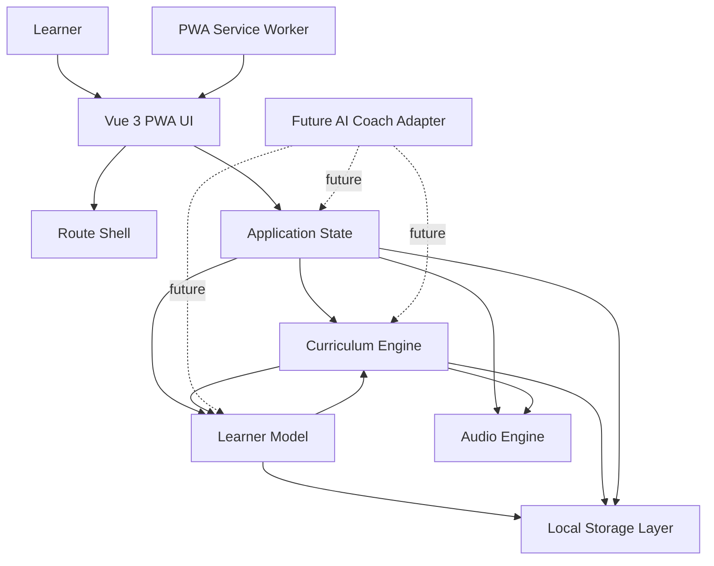
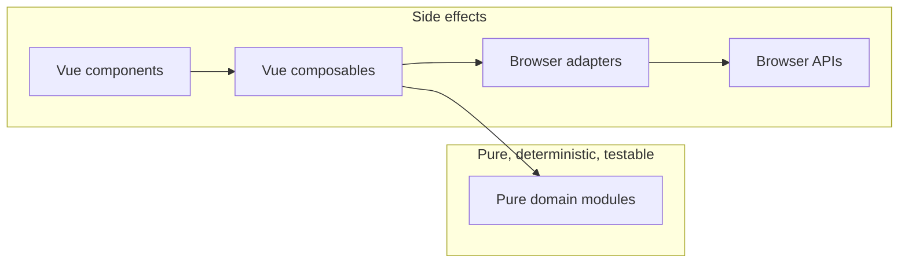
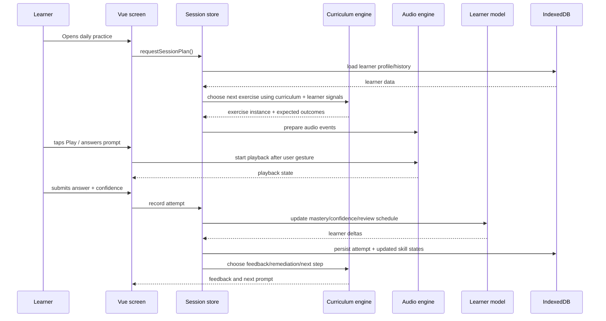
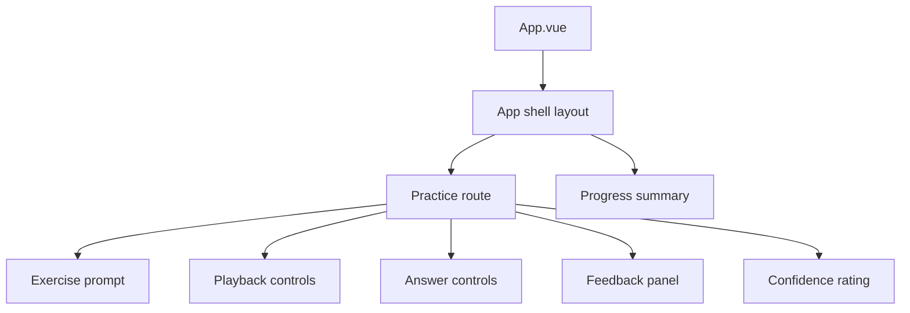
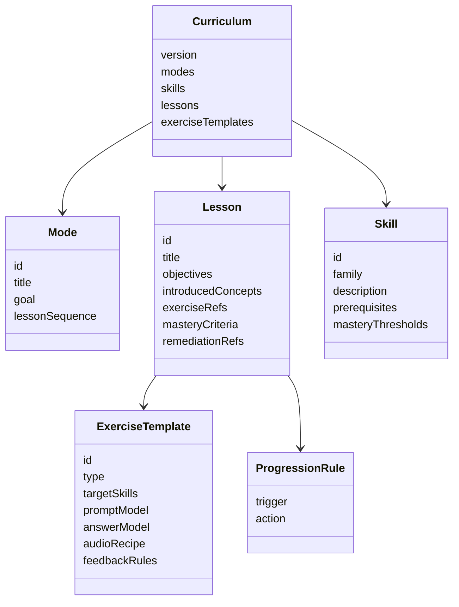
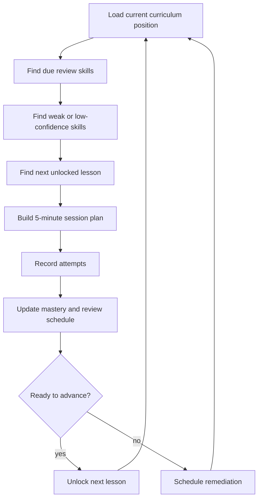
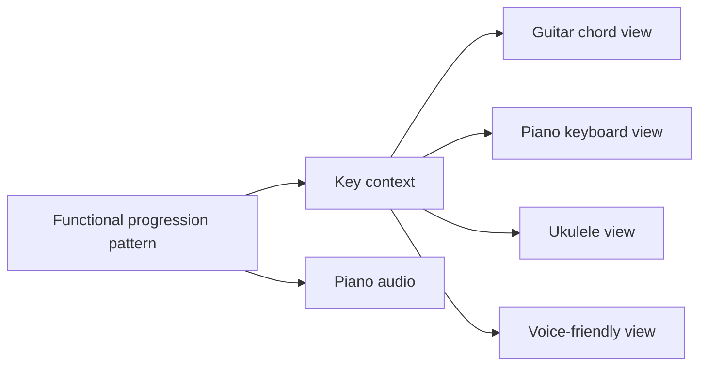
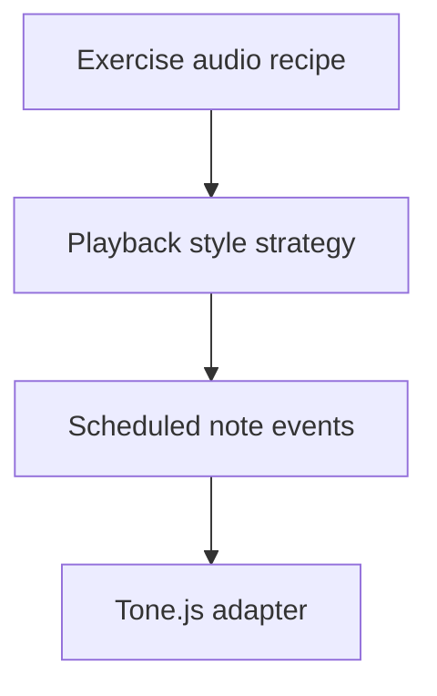
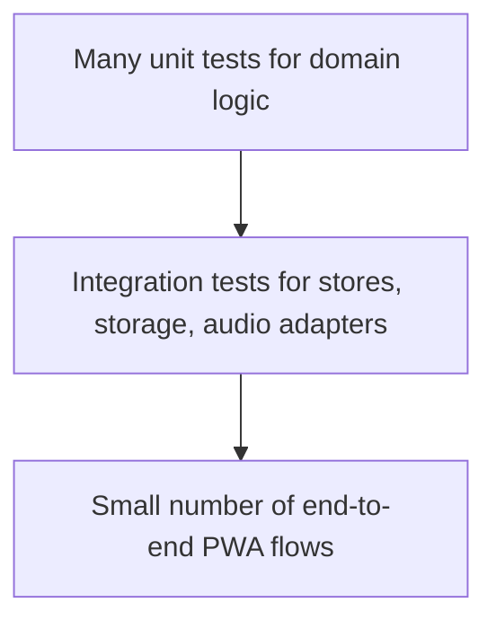
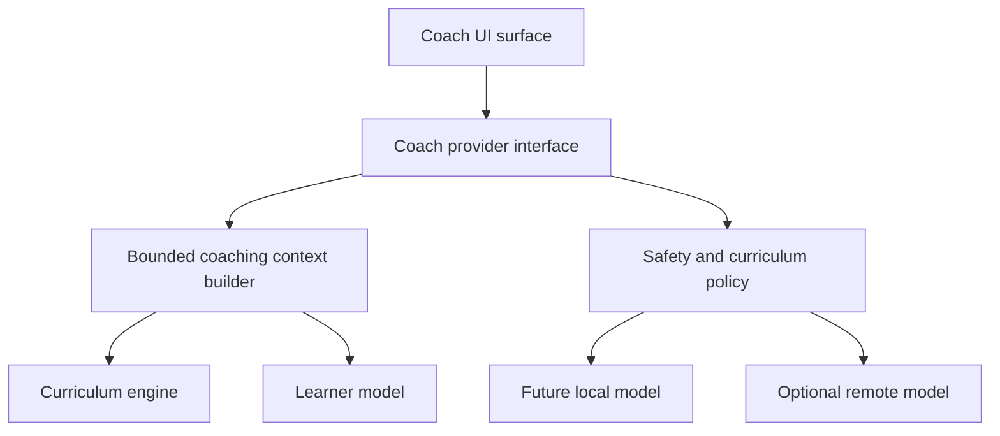

# Software Architecture Proposal: Local-First Music Coach

## Document status

- **Status:** Proposed for review.
- **Audience:** product, curriculum, design, engineering, and future AI-assisted contributors.
- **Implementation state:** No application code is proposed in this document. This is an architecture review artifact to approve before scaffolding begins.
- **Assumption:** The curriculum architecture has been approved and is the source of truth for learning goals, lesson progression, exercise families, mastery criteria, remediation stance, and mentor voice.

## Architecture goals

The system architecture optimizes for:

- **Single-user operation:** one learner, one local profile, no required account, no multi-user synchronization in the initial architecture.
- **Offline-first usage:** practice, review, audio playback, progress tracking, and curriculum navigation must work without network access after the PWA is installed and curriculum/audio code assets are cached.
- **iPhone/iPad Safari PWA:** architecture must account for mobile Safari storage limits, audio unlock requirements, installability constraints, and service worker update behavior.
- **Small incremental pull requests:** subsystems should have clear seams so implementation can proceed in reviewable slices.
- **Long-term maintainability:** domain logic should be isolated from UI, browser APIs, audio playback, and future AI coaching.
- **AI-assisted development:** architecture should favor typed contracts, deterministic fixtures, small modules, and documentation that lets future coding agents make narrow changes safely.

## Non-goals for the initial implementation

- Multi-user accounts or cloud sync.
- Server-rendered application behavior.
- Recorded audio analysis or microphone-based pitch detection.
- MIDI input.
- Full notation rendering.
- Real sampled piano libraries that require large downloads.
- AI-generated curriculum replacing the approved curriculum model.
- Native iOS application packaging.

## 1. System Overview

### Major subsystems



| Subsystem | Responsibilities | Should not own |
| --- | --- | --- |
| Vue 3 UI | Render lesson screens, exercise prompts, feedback, navigation, install/update affordances, and accessibility semantics. | Curriculum progression rules, mastery calculations, audio scheduling internals, IndexedDB schema details. |
| Application state | Coordinate current session state, exercise lifecycle, loading/error states, and user preferences. | Long-term learning algorithms or persisted data schema definitions. |
| Curriculum engine | Represent lessons, skills, exercises, functional harmony concepts, sequencing, remediation options, and next-activity selection inputs. | Browser storage, Tone.js nodes, Vue components, or AI chat behavior. |
| Learner model | Persist and calculate practice history, confidence calibration, mastery estimates, spaced repetition due dates, and adaptation signals. | The canonical curriculum graph or UI presentation. |
| Audio engine | Generate synthesized piano examples, schedule playback, expose transport controls, and manage mobile audio lifecycle. | Curriculum decisions, learner mastery, or persistence policy. |
| Storage layer | Provide typed repositories over IndexedDB, migrations, import/export hooks, and storage health checks. | Domain-specific progression calculations. |
| PWA service worker | Cache application shell and static assets, support offline startup, and coordinate updates. | Learner data persistence or curriculum domain rules. |
| Future AI coach adapter | Produce explanations, encouragement, reflection prompts, and optional local coaching based on bounded context. | Canonical mastery state, curriculum authority, or direct mutation of learner records. |

### Responsibility boundaries

The proposed architecture uses a layered boundary model:



Pure domain modules should be usable from tests without DOM, IndexedDB, service workers, or Web Audio. Browser adapters should be thin and replaceable in tests.

### Primary data flow

A typical practice interaction flows as follows:



### Architectural principles

1. **Curriculum is data plus deterministic rules.** Lesson definitions should be inspectable, versioned, and validated. Progression rules should be pure functions where possible.
2. **Learner state is append-friendly.** Attempts should be recorded as durable events, with derived mastery snapshots stored for performance.
3. **Audio is scheduled, not improvised by UI.** UI requests playback of a prepared musical event; the audio engine owns timing and Web Audio/Tone.js details.
4. **Offline is the default path.** Network availability should not be required for daily use.
5. **Adapters isolate browser volatility.** IndexedDB, service worker, Web Audio, and install/update APIs should be wrapped behind local interfaces.
6. **Future AI is advisory.** AI coaching may explain, encourage, summarize, or suggest, but the curriculum engine and learner model remain authoritative.

## 2. Frontend Architecture

### Vue 3 structure

The frontend should be a Vue 3 single-page PWA using the Composition API. The initial project structure should be organized by responsibility rather than by technology alone.

Proposed structure once implementation begins:

```text
src/
  app/
    App.vue
    router/
    providers/
    layouts/
  features/
    practice/
    curriculum-map/
    learner-progress/
    settings/
    onboarding/
  domain/
    curriculum/
    learner/
    music-theory/
    scheduling/
  audio/
    tone-adapter/
    playback-models/
  storage/
    indexed-db/
    migrations/
    repositories/
  pwa/
    service-worker-registration/
    update-state/
  shared/
    components/
    composables/
    types/
    test-fixtures/
```

Feature folders may contain Vue screens and feature-specific composables. Domain folders should contain framework-independent TypeScript.

### Component hierarchy



Components should stay presentation-focused. Exercise-specific display should be driven by typed view models produced by feature composables or stores.

### TypeScript usage

TypeScript should be used as an architectural boundary tool, not only as syntax checking.

Recommended conventions:

- Use strict TypeScript settings from the first scaffold.
- Represent domain IDs with branded or nominal types where practical, such as `LessonId`, `SkillId`, `ExerciseId`, and `AttemptId`.
- Use discriminated unions for exercise types, answer types, confidence ratings, playback events, and migration states.
- Define explicit interfaces at subsystem boundaries:
  - `CurriculumRepository`
  - `LearnerRepository`
  - `AudioPlaybackEngine`
  - `SessionPlanner`
  - `CoachProvider`
- Validate persisted and curriculum data at runtime before use. Static typing alone is insufficient for IndexedDB data and future curriculum migrations.
- Keep domain modules free from Vue-specific types such as `Ref`, `ComputedRef`, or component instances.

### Routing approach

Use client-side routing with shallow, durable routes that support offline reloads.

Initial route proposal:

| Route | Purpose |
| --- | --- |
| `/` | Redirect to daily practice or onboarding depending on local profile state. |
| `/onboarding` | First-run setup, audio permission primer, and learning stance introduction. |
| `/practice` | Default daily 5-minute practice flow. |
| `/practice/:sessionId` | Optional resumable session route for recovery after reload. |
| `/map` | Curriculum overview and unlocked skills. |
| `/progress` | Practice history, confidence trends, and mastery summary. |
| `/settings` | Audio, accessibility, data export/reset, and PWA update controls. |
| `/about` | Local-first explanation and curriculum attribution. |

Routing principles:

- Routes should not encode sensitive learner state beyond opaque local IDs.
- Route guards should be lightweight and local-only.
- A route reload while offline should restore enough state to continue or safely restart the current exercise.
- Deep links are useful for local navigation but not required to be shareable across devices in the initial version.

### State management approach

Use a small number of explicit stores rather than one global catch-all store.

Recommended store boundaries:

| Store | Responsibility | Persistence |
| --- | --- | --- |
| `appStore` | App initialization, online/offline indicator, service worker update state, global errors. | Mostly ephemeral. |
| `practiceSessionStore` | Current session plan, active exercise, answer lifecycle, feedback, elapsed time. | Persist resumable session checkpoints. |
| `learnerStore` | Loaded learner profile, skill summaries, progress dashboard data. | Backed by IndexedDB repositories. |
| `audioStore` | Audio unlock state, playback status, selected timbre/style, tempo preference. | Persist preferences only. |
| `settingsStore` | Accessibility settings, data export/reset choices, coach feature flags. | Persist preferences. |

Pinia is the recommended state management library because it aligns with Vue 3, is lightweight, and is easy to test. Domain logic should live outside Pinia stores. Stores should orchestrate calls to domain services and adapters.

## 3. Curriculum Engine

### Curriculum representation

The curriculum engine should model the approved curriculum as a typed graph of learning content and skill dependencies.



Recommended curriculum entities:

- **Concept:** a stable idea such as tonic, Do, I, IV, V, vi, cadence, or movable function.
- **Skill:** a measurable learner capability, such as judging arrival, distinguishing I/V, or recognizing vi in a loop.
- **Lesson:** a teachable unit containing objectives, mentor copy, examples, and exercise templates.
- **Exercise template:** a reusable task pattern parameterized by key, tempo, voicing, progression, answer format, difficulty, and feedback.
- **Exercise instance:** a concrete generated prompt presented to the learner during a session.
- **Progression rule:** logic for unlocking, reviewing, remediating, or advancing.
- **Mastery criterion:** thresholds and evidence requirements that determine whether a skill is dependable enough for the next curriculum step.

### Lessons, exercises, and progression

Lessons should be represented as explicit curriculum data with pure helper functions that generate session-ready exercises. For maintainability, curriculum content should be separated from rendering and audio implementation.

Exercise generation should support:

- Key selection across beginner-friendly keys.
- Difficulty adjustments such as slower tempo, fewer choices, stronger cadences, or repeated reference I.
- Multiple answer modes, including binary choice, A/B comparison, function choice, next-chord prediction, and confidence rating.
- Immediate feedback with a replay or resolution option.
- Remediation variants for known confusions, such as IV versus V or I versus vi.

Progression should use a combination of curriculum order and learner evidence:



The session planner should prioritize:

1. Safety and learner confidence: avoid overwhelming answer choices.
2. Due review of previously introduced skills.
3. Remediation of high-error or low-confidence skills.
4. Introduction of one small new concept when readiness criteria are met.
5. A tiny win summary at session end.

### Support for functional harmony concepts

Functional harmony should be modeled as first-class domain data rather than hard-coded display strings.

Recommended model elements:

- `ScaleDegree`: Do/Re/Mi/Fa/Sol/La/Ti and numeric equivalents.
- `HarmonicFunction`: tonic, dominant, predominant, relative-minor color, passing/other future extensions.
- `RomanNumeral`: I, IV, V, vi, and later extensions.
- `NashvilleNumber`: 1, 4, 5, 6m, and later extensions.
- `KeyContext`: tonic pitch, mode, preferred notation, friendly instrument mappings.
- `ChordRole`: function label plus emotional/plain-language descriptors such as home, wants home, lift/opening, familiar minor-family color.
- `ProgressionPattern`: ordered functional roles independent of key.
- `CadencePattern`: goal-oriented movements such as V-I and IV-I.

This allows one exercise to display the same underlying content as Roman numerals, Nashville numbers, movable Do, chord names, or future instrument diagrams.

### Support for future instrument-specific views

The initial curriculum should remain instrument-neutral, with synthesized piano as the shared audio reference. Future instrument-specific views should be presentation and mapping layers over the same functional core.



Instrument-specific adapters should answer questions such as:

- What chord names correspond to I, IV, V, and vi in this key?
- What beginner-friendly shape or voicing should be displayed?
- What keys are most comfortable for this instrument profile?
- Does the view require transposition or capo information?

The curriculum engine should not depend on any specific instrument adapter.

## 4. Learner Model

### Practice history

Practice history should be append-only at the attempt level. Derived summaries can be recalculated or migrated as algorithms improve.

Suggested event records:

- `PracticeSessionStarted`
- `ExercisePresented`
- `PlaybackRequested`
- `AnswerSubmitted`
- `ConfidenceRated`
- `FeedbackShown`
- `HintUsed`
- `ExerciseCompleted`
- `PracticeSessionEnded`

A compact implementation may store these as structured attempt/session records rather than a full event-sourcing framework, but the data model should preserve enough history to understand what happened and why mastery changed.

### Confidence ratings

The approved curriculum treats confidence as learning data. Confidence should be recorded with every meaningful answer.

Initial rating scale:

| UI label | Domain value | Meaning |
| --- | --- | --- |
| Sure | `sure` | Learner believes they recognized it. |
| Maybe | `maybe` | Learner narrowed it down or is partially confident. |
| Guess | `guess` | Learner chose without dependable recognition. |

Confidence should influence mastery differently from correctness:

- Correct + sure: strongest positive evidence.
- Correct + maybe: moderate positive evidence.
- Correct + guess: weak positive evidence and possible lucky answer.
- Incorrect + sure: important misconception signal.
- Incorrect + maybe/guess: normal learning signal, often remediated gently.

### Mastery tracking

Mastery should be tracked per skill, not only per lesson. A lesson may advance when enough target skills show dependable evidence.

Recommended skill state fields:

- `skillId`
- `introducedAt`
- `lastPracticedAt`
- `attemptCount`
- `correctCount`
- `recentAccuracy`
- `confidenceCalibration`
- `masteryEstimate`
- `stabilityEstimate`
- `dueAt`
- `confusionPairs`
- `status`: not introduced, introduced, practicing, review, mastered, needs remediation

Mastery should avoid a single brittle score. Use a small composite of:

- Recent accuracy.
- Confidence-weighted correctness.
- Time since last successful practice.
- Variety of contexts, such as keys, tempos, registers, and playback patterns.
- Confusion tracking, such as mistaking IV for V.

### Spaced repetition

The learner model should schedule reviews for skills rather than isolated flashcards. Each review can be fulfilled by multiple exercise templates.

Initial spaced repetition strategy:

1. New or weak skills are reviewed soon, often within the same session or next session.
2. Skills with accurate and confident responses get longer intervals.
3. Incorrect or low-confidence responses shorten the interval.
4. Confident incorrect responses trigger targeted contrast exercises.
5. Skills should be reviewed in varied musical contexts to support transfer across keys.

The exact algorithm can start simple and deterministic, for example interval buckets, then evolve later without changing storage contracts.

### Adaptation strategy

Adaptation should be transparent, bounded, and curriculum-respecting.

Adaptation inputs:

- Current lesson position.
- Due skill reviews.
- Recent accuracy and confidence.
- Specific confusion pairs.
- Hints and replay usage.
- Session length target.
- Learner preferences such as tempo or accessibility settings.

Adaptation outputs:

- Next exercise template.
- Difficulty parameters.
- Remediation choice.
- Feedback emphasis.
- Whether to introduce new material or continue review.

The engine should never skip core prerequisites simply because a learner guesses correctly. Advancement should require enough evidence across context variations.

## 5. Audio Architecture

### Tone.js usage

Tone.js is the recommended initial audio library because it provides musical scheduling abstractions on top of Web Audio while remaining suitable for synthesized piano prototypes.

Initial responsibilities for the Tone.js adapter:

- Initialize and unlock audio in response to a user gesture.
- Own Tone.js instrument nodes and effects.
- Convert domain-level musical events into Tone.js scheduled events.
- Expose playback lifecycle events to the UI.
- Stop, dispose, or reset nodes safely between exercises.
- Keep Tone.js types out of curriculum and learner domain modules.

### Scheduling

The audio engine should accept declarative playback recipes, not ad hoc UI callbacks.

Example conceptual playback recipe:

```text
PlaybackRecipe
  tempo: 84
  meter: 4/4
  key: C major
  style: block-piano
  events:
    measure 1 beat 1: chord I, duration 4 beats
    measure 2 beat 1: chord V, duration 4 beats
    measure 3 beat 1: chord I, duration 4 beats
```

Scheduling principles:

- Build complete event lists before playback when possible.
- Use Tone.Transport or a local scheduler abstraction consistently.
- Use lookahead scheduling for stable timing.
- Treat UI animations as followers of audio state, not as timing sources.
- Provide deterministic test hooks that inspect scheduled event plans without needing real audio output.

### Timing

Timing is central for musical trust. The architecture should distinguish:

- **Musical time:** measures, beats, subdivisions, tempo, meter.
- **Audio time:** Web Audio context time and scheduled event offsets.
- **UI time:** progress bars, buttons, and visual feedback.

The audio engine should map musical time to audio time. UI should subscribe to playback state and approximate progress visually. UI timing drift should not affect audio playback.

Mobile Safari considerations:

- Audio context must be started from a direct user gesture.
- The first practice flow should include an explicit audio-ready interaction.
- Silent mode, volume settings, and Bluetooth latency may affect perceived playback.
- The app should provide clear retry and troubleshooting states when audio cannot start.

### Synthesized piano generation

Initial synthesized piano should be generated locally, not streamed.

Recommended progression:

1. Start with a lightweight polyphonic synth patch shaped to be piano-like enough for harmonic training.
2. Add simple voicing rules for triads and inversions.
3. Add velocity and envelope variation to reduce fatigue.
4. Later evaluate compact sampled piano assets only if synthesized timbre is not educationally sufficient.

The first architecture should include a `PlaybackStyle` abstraction:

- `block-piano`
- `broken-chord-piano`
- `bass-plus-chord-piano`
- `cadence-reference`
- future styles such as strum, arpeggiated guitar-like playback, metronome-supported playback, or voice-leading examples.

### Future support for additional playback styles

Playback style should be selected by curriculum exercise needs and learner settings. A style should be a strategy that converts harmonic content into playable note events.



Future styles should not require changes to lesson progression, learner mastery, or UI answer models unless they introduce a new exercise type.

## 6. Storage Architecture

### IndexedDB schema proposal

IndexedDB is the recommended durable local store because it supports structured data, larger capacity than `localStorage`, and offline PWA use. Use a small wrapper such as Dexie or an equivalent typed repository layer when implementation begins.

Proposed database: `music-coach-local`

| Store | Key | Purpose |
| --- | --- | --- |
| `meta` | `key` | Schema version, app build metadata, migration status, feature flags. |
| `profile` | `profileId` | Single learner profile and preferences. |
| `curriculumPacks` | `packId` | Installed curriculum metadata, version, checksum, and activation state. |
| `curriculumProgress` | `[profileId, curriculumVersion]` | Current mode, lesson, unlocked skills, completed milestones. |
| `practiceSessions` | `sessionId` | Session start/end times, plan summary, completion state. |
| `attempts` | `attemptId` | Exercise attempts, answers, correctness, confidence, hints, playback metadata. |
| `skillStates` | `[profileId, skillId]` | Mastery estimate, due date, recent stats, status. |
| `reviewQueue` | `[profileId, dueAt, skillId]` | Queryable due reviews and priorities. |
| `settings` | `key` | Audio, accessibility, update, and display preferences. |
| `coachMemory` | `memoryId` | Future bounded local AI summaries, not canonical learner state. |
| `outbox` | `eventId` | Future optional export/sync events; initially local-only. |

Schema principles:

- Store curriculum version on attempts so historical records remain interpretable after curriculum updates.
- Store generated exercise parameters with attempts, not only template IDs.
- Use derived `skillStates` for fast UI and planning, while preserving attempt records as evidence.
- Avoid storing large audio assets in IndexedDB initially; cache static assets through the service worker.
- Provide export and reset paths from the beginning of the storage design.

### Offline-first behavior

Offline-first means local is primary, not merely a fallback.

Expected behavior:

- App shell loads offline after initial install/cache.
- Curriculum definitions needed for current content are available offline.
- Practice sessions can start, complete, and persist offline.
- Audio generation works offline because it is synthesized locally.
- Progress dashboards read from IndexedDB.
- The app can show network status but should not block practice on connectivity.
- If future optional cloud export exists, it uses an outbox and does not affect local practice.

### Migration strategy

Migrations should be explicit, versioned, reversible where practical, and test-covered.

Migration principles:

- Separate app schema version from curriculum content version.
- Run migrations before normal app usage.
- Back up critical records or use staged migrations for destructive changes.
- Mark migration status in `meta` so interrupted migrations can resume or fail safely.
- Provide user-visible recovery options for unrecoverable local data problems, including export if possible and reset if necessary.
- Maintain test fixtures for old schema versions.

Curriculum migrations should handle:

- Renamed skills.
- Split or merged lessons.
- Updated mastery criteria.
- Deprecated exercise templates.
- Historical attempts tied to older curriculum versions.

## 7. PWA Architecture

### Offline support

The PWA should use a service worker to cache the application shell, static curriculum assets, icons, and any bundled audio-support assets. Runtime data remains in IndexedDB.

Recommended caching categories:

| Category | Strategy |
| --- | --- |
| App shell JavaScript/CSS/HTML | Precache by build hash. |
| Icons and manifest | Precache. |
| Curriculum JSON shipped with app | Precache by version/hash. |
| Optional small audio assets | Precache if bundled and size is acceptable. |
| External docs or links | Network-only or avoid dependency. |
| Learner data | IndexedDB, never service worker cache. |

### Installability

The app should include:

- Web app manifest with iOS-appropriate icons and display mode.
- Mobile viewport configuration suitable for iPhone/iPad.
- Clear user education for adding to Home Screen on Safari.
- Offline-ready first-run flow after the app has loaded.
- Settings page indicator for app version, cache status, and update availability.

Safari-specific considerations:

- iOS install prompts are less automatic than Chromium prompts.
- Storage may be evicted by the OS under pressure; export and backup messaging should be available.
- Service worker behavior and cache persistence should be tested on actual or simulated iOS Safari where possible.

### Update strategy

PWA updates should be safe and learner-friendly.

Recommended flow:

1. New service worker installs in the background.
2. App notifies learner that an update is ready.
3. Learner can apply update after finishing current practice.
4. App reloads, then runs schema/curriculum migrations if needed.
5. If migration fails, app shows a recovery state rather than silently losing data.

Avoid forcing an update during an active exercise unless the app is in an unrecoverable state.

### Asset caching

Asset caching should be intentionally small for mobile devices.

Guidelines:

- Prefer synthesized audio over large sample libraries.
- Keep first install lightweight.
- Cache only the active curriculum pack initially.
- Use hashed filenames for immutable build assets.
- Provide cache cleanup during app upgrades.
- Monitor storage estimates where browser support exists.

## 8. Testing Strategy

### Testing pyramid



The architecture should maximize pure unit tests and minimize fragile browser-only tests.

### Unit testing

Unit tests should cover:

- Music theory helpers such as key mapping, chord construction, scale degrees, and progression representation.
- Curriculum graph validation.
- Exercise generation from templates.
- Answer evaluation.
- Feedback rule selection.
- Mastery and confidence calculations.
- Spaced repetition interval updates.
- Session planning.

Domain tests should run without a browser.

### Curriculum engine testing

Curriculum tests should verify:

- All lessons reference existing skills and exercise templates.
- Prerequisites form a valid directed acyclic graph unless an intentional review loop is modeled separately.
- Every introduced concept has at least one practice opportunity.
- Mastery criteria reference measurable attempt data.
- Remediation paths exist for known confusions.
- Generated exercises are valid across supported keys.
- First-week curriculum constraints remain intact as content evolves.

Snapshot tests may help review generated session plans, but avoid overusing snapshots for behavior that should be asserted semantically.

### Learner model testing

Learner model tests should verify:

- Correct/confidence combinations update mastery as intended.
- Confident wrong answers create misconception signals.
- Low-confidence correct answers do not over-advance mastery.
- Due review dates move earlier or later appropriately.
- Review queue prioritization remains stable and explainable.
- Historical attempts remain interpretable after curriculum migrations.
- Adaptation does not skip required prerequisites.

### Audio testing

Audio tests should be split into deterministic plan tests and browser playback smoke tests.

Plan-level tests:

- Playback recipes convert to expected note events.
- Chord voicings match key/function definitions.
- Tempo and meter mapping produce expected timings.
- Stop/cancel behavior clears scheduled events in adapter tests.

Browser/manual tests:

- Audio unlock works after a user gesture on iPhone/iPad Safari.
- Playback starts and stops reliably.
- No overlapping stale audio after route changes.
- Bluetooth or silent-mode edge cases are documented.

Automated tests should not depend on hearing sound. They should inspect scheduled events and adapter state.

### PWA testing

PWA tests should verify:

- App shell loads offline after install/cache.
- Practice route can reload offline.
- IndexedDB data survives normal reloads and updates.
- Service worker update prompt appears without interrupting a session.
- Cache cleanup does not remove active assets.
- Manifest includes required icons and display metadata.
- Data export/reset paths behave predictably.

A small Playwright test suite can cover app-shell and offline route behavior once implementation begins. iOS Safari behavior should also be covered by a manual release checklist because desktop automation cannot fully represent it.

## 9. Future AI Coach Integration

### How coaching fits into the architecture

AI coaching should be an optional advisory layer above the curriculum engine and learner model.



Possible coaching surfaces:

- Warm explanation after a mistake.
- End-of-session reflection.
- Confidence calibration encouragement.
- Plain-language summary of progress.
- Suggestion to replay, slow down, or compare two sounds.
- Future question-answer help about already introduced concepts.

### Boundaries between curriculum and coaching

The curriculum engine remains authoritative for:

- What concepts exist.
- What lessons are unlocked.
- What exercise is next.
- What answer is correct.
- What counts as mastery.
- What remediation is appropriate.

The learner model remains authoritative for:

- Practice history.
- Confidence ratings.
- Mastery estimates.
- Review scheduling.
- Adaptation signals.

The AI coach may:

- Rephrase approved concepts.
- Explain a current mistake using provided answer context.
- Encourage the learner in the approved mentor voice.
- Summarize recent progress.
- Ask reflective questions.
- Suggest using an existing remediation or replay option.

The AI coach must not:

- Invent new curriculum paths as canonical content.
- Override answer correctness.
- Mutate mastery directly.
- Depend on network availability for core practice.
- Store unbounded conversational history as canonical learner data.

### Adding future local AI without redesign

Design now for a stable `CoachProvider` interface:

```text
CoachProvider
  explainAttempt(context) -> CoachMessage
  summarizeSession(context) -> CoachMessage
  suggestReflection(context) -> CoachMessage
```

The context builder should provide bounded, structured inputs:

- Current lesson and introduced concepts.
- Current exercise prompt and correct answer.
- Learner answer and confidence.
- Recent skill summaries.
- Approved mentor voice and safety instructions.
- Allowed coaching actions.

Provider implementations can later include:

- Rule-based templates.
- Local small language model.
- Optional remote model.
- Hybrid rule-first, model-assisted explanations.

Because the UI talks to `CoachProvider`, and `CoachProvider` receives bounded context from curriculum and learner services, a future local AI model can be added without redesigning progression, storage, or exercise evaluation.

## 10. Risks and Alternatives

### Major architectural risks

| Risk | Impact | Mitigation |
| --- | --- | --- |
| iOS Safari storage eviction | Learner progress could be lost if the OS clears site data. | Provide export/reset tools, keep data compact, educate users that local-first data lives on device, and consider optional backup later. |
| Mobile audio unlock and timing quirks | Learner may hear no sound or unreliable playback. | Design explicit audio unlock flow, test on iPhone/iPad, keep UI timing separate from audio timing, and provide troubleshooting states. |
| Curriculum logic becomes entangled with UI | Future changes become slow and risky. | Keep curriculum engine framework-independent with typed contracts and domain tests. |
| Mastery algorithm overfits early assumptions | Learners may advance too quickly or get stuck. | Store attempt evidence, keep algorithms versioned, start simple, and make derived mastery recalculable. |
| PWA update interrupts practice | Active sessions could be lost or corrupted. | Use learner-controlled update activation and resumable session checkpoints. |
| Tone.js abstraction leaks everywhere | Audio implementation becomes hard to replace. | Hide Tone.js behind an `AudioPlaybackEngine` and test scheduled event plans separately. |
| Future AI coach creates inconsistent pedagogy | Learner receives advice outside approved curriculum. | Bound AI context, enforce coaching policy, make curriculum authoritative, and prefer rule-based templates initially. |
| Architecture over-engineering slows first implementation | Too much abstraction could delay usable practice. | Implement interfaces incrementally, avoid speculative providers until needed, and keep pull requests small. |

### Alternatives considered

#### Local-first PWA vs native iOS app

- **Chosen:** local-first PWA.
- **Reason:** fastest path to cross-device browser access, simple deployment, no app store dependency, and aligns with documentation-first incremental development.
- **Tradeoff:** iOS PWA storage, install prompts, and audio behavior require careful testing and user education.

#### IndexedDB vs `localStorage`

- **Chosen:** IndexedDB.
- **Reason:** structured records, larger capacity, better suited for attempt history, migrations, and future export/sync.
- **Tradeoff:** more implementation complexity; should be hidden behind repositories.

#### Synthesized piano vs sampled piano

- **Chosen:** synthesized piano initially.
- **Reason:** small offline footprint, fast startup, no large asset cache, and sufficient for initial functional harmony training if designed carefully.
- **Tradeoff:** timbre may be less realistic; compact samples can be evaluated later behind the playback style abstraction.

#### Pinia stores vs custom reactive service container

- **Chosen:** Pinia for application state orchestration.
- **Reason:** Vue-native, simple, testable, and familiar to contributors.
- **Tradeoff:** domain logic must be intentionally kept outside stores to avoid framework coupling.

#### Fully data-authored curriculum vs hard-coded lessons

- **Chosen:** typed data plus deterministic rules.
- **Reason:** easier review, validation, migrations, and AI-assisted editing; supports future curriculum packs.
- **Tradeoff:** requires schema design and validation before implementation.

#### Rule-based coach first vs AI coach first

- **Chosen:** rule-based coaching templates first, AI provider interface reserved for later.
- **Reason:** reliable offline behavior, consistent mentor voice, and simpler approval path.
- **Tradeoff:** less conversational flexibility until local or optional AI providers are added.

## Incremental implementation roadmap after approval

This document does not implement or scaffold the application. If approved, implementation should proceed in small pull requests such as:

1. Tooling scaffold and empty app shell.
2. Domain type definitions for curriculum and music theory.
3. Curriculum validation fixtures based on the approved curriculum architecture.
4. Learner model pure functions and tests.
5. IndexedDB repository layer and migrations.
6. Tone.js playback adapter with testable scheduled event plans.
7. Practice session state orchestration.
8. First lesson UI flow.
9. PWA manifest and service worker offline shell.
10. Progress/settings/export surfaces.
11. Rule-based coach messaging interface.

Each pull request should preserve runnable tests and avoid broad cross-subsystem rewrites.

## Open review questions

Before implementation begins, reviewers should approve or revise:

1. Whether Pinia is acceptable as the state orchestration layer.
2. Whether Dexie or another IndexedDB wrapper should be preferred when scaffolding begins.
3. Whether Mermaid diagrams are acceptable as the source format for architecture diagrams.
4. Whether first implementation should include data export/reset immediately or in the second milestone.
5. Which exact browser/device matrix is required before the first release candidate.
